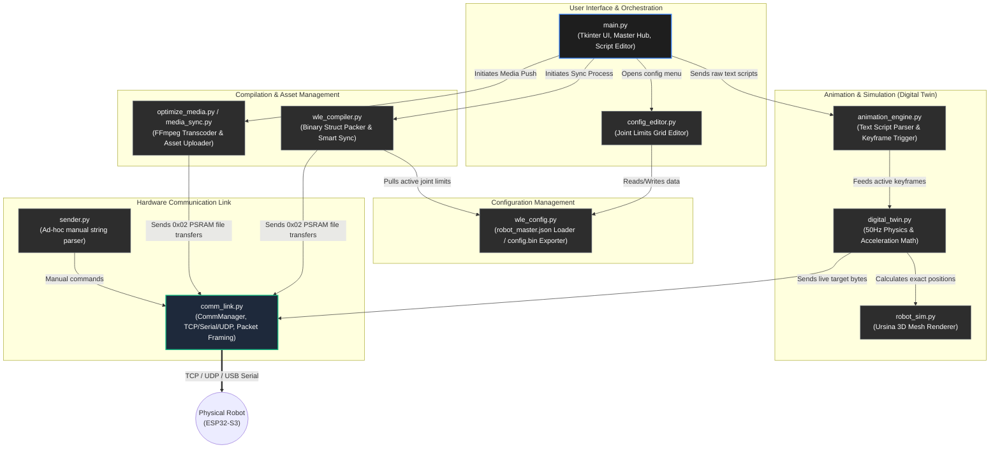

# Architecture

## 1. MAIN CONTROLLER ESP32-S3
The character is driven by a single **ESP32-S3** running a sketch split across
`Walle-double.ino` (setup/loop, hardware I/O, kinematics), `z_sys_mgr.ino` (stream/command
parsing, file transfer, system commands), and `z_eye_render.ino` (procedural eye graphics).
![[wle5_main_esp32_dataflow.svg|606]]
### FreeRTOS task layout

| Task                         | Core | Priority    | Rate                             | Responsibility                                                                                                             |
| ---------------------------- | ---- | ----------- | -------------------------------- | -------------------------------------------------------------------------------------------------------------------------- |
| `loop()` (Arduino main loop) | 1    | default     | ~100 Hz (10 ms delay)            | TCP/USB/UDP ingestion, animation/idle-state scheduling, telemetry heartbeat                                                |
| `KinematicsTask`             | 1    | 3 (highest) | fixed 50 Hz (`vTaskDelayUntil`)  | Autonomous blink/aperture generators, per-joint accel-limited motion (`updateJointPhysics`), writes to servos/PCA9685/LEDC |
| `GfxTask`                    | 1    | 1           | as fast as SPI allows (20-40fps) | Renders the two eye displays (symmetric or independent "asymmetric" mode)                                                  |
| `AudioTask`                  | 0    | 2           | event-driven                     | Plays/stops MP3 assets from flash through the ES8311 codec                                                                 |

Core 0 is otherwise reserved for the Wi-Fi/BT radio stack; putting `AudioTask` there keeps
audio decoding off the core doing kinematics and SPI display pushes.

## 

### Motion profile

`updateJointPhysics()` runs at a fixed 50 Hz per active joint and computes an
acceleration-limited ("trapezoidal-like") velocity each tick: it derives a safe braking
velocity from the remaining distance and `max_acc`, ramps `current_velocity` toward the
requested `target_velocity` (clamped to `max_spd`), and integrates position. A
`target_velocity` of 255 is a special "snap immediately" instruction that bypasses the
ramp. This is also the profile mirrored in the PC-side `digital_twin.py` so the desktop
preview matches physical motion.

### Command arbitration

Three producers can set a joint's `target_position` / `target_velocity`, merged inside
`pushCommandToEngine()`:

1. **Live external commands** — from the TCP/USB/UDP link Receiving a live
   command for a joint that's currently being driven by an animation cancels that
   animation (`active_anim_id = 0`). (see   [02-communication-protocols.md](04-communication-protocols.md)). 
2. **Animation playback** — keyframes (`BinKeyframe`/`BinCommand`) from a loaded
   `BinAnimation`, played out against elapsed time in `loop()`.
3. **Idle-state ("Alive") behavior engine** — after `idle_timeout_sec` of inactivity,
   weighted-random animation selection per the current idle *state* (e.g. `Alive`,
   `Shifty`, `Sleepy` — see [03-animation-authoring.md](03-animation-authoring.md)), plus
   two always-on procedural generators layered directly into `KinematicsTask`: an
   autonomous blink cycle and an aperture ("focus hunt") twitch.

## 3. Desktop app — "WLE5 Studio"

A Tkinter application (`python/main.py`, packaged via `WLE5_Studio.spec`) that composes
several modules:

| Module                                | Role                                                                                                                                                                                  |
| ------------------------------------- | ------------------------------------------------------------------------------------------------------------------------------------------------------------------------------------- |
| `main.py`                             | Main window: live joint jogging, animation script editor, sync UI, Wi-Fi setup dialog                                                                                                 |
| `digital_twin.py`                     | Physics-accurate mirror of `updateJointPhysics()` for offline/preview jogging without hardware                                                                                        |
| `robot_sim.py`                        | 3D visual digital twin (procedural rig/mesh) that renders the robot state visually                                                                                                    |
| `comm_link.py`                        | Transport abstraction (`TCPLink` wraps a socket as a `serial.Serial`-like object) + `CommManager`, which frames outgoing joint/play/Wi-Fi packets and decodes the telemetry heartbeat |
| `animation_engine.py`                 | Parses/plays the master-script animation language for live preview                                                                                                                    |
| `sender.py`                           | Parses ad-hoc manual command strings for quick manual testing                                                                                                                         |
| `wle_compiler.py`                     | Compiles animations to binary and drives the "smart sync" push to the robot (PSRAM file-transfer protocol)                                                                            |
| `config_editor.py`                    | Grid editor for `robot_master.json` (per-joint calibration, ranges, hardware mapping)                                                                                                 |
| `wle_config.py`                       | Loads/saves `robot_master.json`; exports `robot_config.h` (virtual joint IDs) and `config.bin` (binary `BinJointConfig` table) for the firmware                                       |
| `media_sync.py` / `optimize_media.py` | Transcodes audio/images to device-friendly formats and pushes them to the robot's flash filesystem                                                                                    |

# Script Command Flow

- **Parsing:** `animation_engine.py` reads the scripts and converts them into a sequential array of keyframe commands.
- **Digital Twin:** `digital_twin.py` mirrors the ESP32's exact 50Hz physics loop, calculating simulated hardware limits, acceleration, and velocity so the 3D model moves identically to the physical robot.
- **Live Streaming:** Keyframes hit their time threshold and pass their data to `comm_link.py`, which normalizes the degrees into a 0-255 byte value and blasts them to the robot over TCP/Serial.
- **Compiling & Uploading:** `wle_compiler.py` packs the scripts into a strict C++ struct array (`anims.bin`), calculates a CRC32 checksum, and pushes it directly to the robot's PSRAM.

- **`main.py` (The Orchestrator / Reader)**
    
    - _Role:_ Discovers and reads the files from your hard drive.
        
    - _Function:_ The `rescan_scripts()` function uses Regular Expressions (Regex) to scan all `.txt` and `.wle` files, slicing them up into chunks based on the `[Anim: name]` headers. It stores these raw text chunks in memory.
        
- **`animation_engine.py` (The Parser)**
    
    - _Role:_ Translates human text into Python data.
        
    - _Function:_ The `load_script()` function reads the raw text line-by-line. It looks for the `@` symbol to grab the time, and splits the joint commands (e.g., `head=50,100`). It packages these into a sorted list of Python dictionaries (Keyframes).
        
- **`digital_twin.py` (The Physics Processor)**
    
    - _Role:_ Simulates the ESP32's hardware math locally.
        
    - _Function:_ When `animation_engine.py` triggers a keyframe, the data goes here. It applies your `max_acc` and `max_spd` limits over a simulated 50Hz (20ms) loop to generate the smooth transition values that the Ursina 3D model displays.
        
- **`wle_compiler.py` (The Binary Compiler)**
    
    - _Role:_ Translates Python data into strict C++ structs.
        
    - _Function:_ When you click "Sync Configs & Scripts", this file takes the parsed scripts and packs them into raw bytes (`struct.pack()`). It calculates the CRC32 hash and builds the `anims.bin` and `states.bin` files that the ESP32 natively understands.
        

### 

