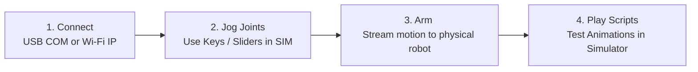

# WLE5 — Quickstart & Operator Reference

**Getting up and running with your robot in 3 simple steps.**

---

## ⚡ 3-Minute Quickstart



### Step 1: Launch & Connect
1. Start **WLE5 Studio** (`WLE5_Studio.exe` or `python python/main.py`).
   ** If you wish to only run animations in the simulator without the EPS32, skip to Step 2
2. Connect the ESP32-S3 via USB-C or power it for connecting via Wi-Fi.
3. In the top-left **LINK** box:
   - Enter your COM port (e.g. `COM9`) for USB, **or**
   - Enter your robot's IP address (e.g. `192.168.1.145`) displayed on the eye screen for Wi-Fi.
4. Click **CONNECT**. When connected, Studio automatically verifies joint configuration parity with the robot.

### Step 2: Jog Joints with Hotkeys
- Try pressing keyboard hotkeys to jog the robot's head and eyes in the simulator:
  - **`A` / `D`**: Turn head yaw left / right
  - **`W` / `S`**: Tilt neck base pitch forward / back
- Alternatively type a value into the SET column and click **<PUSH**
- Notice the **POS** column and the 2D digital twin in the viewport move instantly.

### Step 3: Arm Live Control
- To move the physical robot:
   - Click the **`>>SIM<<`** toggle to flip it to **`<LIVE>`**.
   - Your hotkeys, sliders, and animation playback will now stream directly to the servos and displays!

### Step 4: Test an Animation
1. Select the SCRIPT EDITOR from the **TOOLBOX** dropdown and OPEN a script file
2. In the **Target Anim** dropdown, select an animation (e.g. `Wave_Hello` or `Alive_Idle`).
3. Click **TEST IN SIM** to preview the full motion sequence in the simulator.

---

## 📋 Operator Quick Reference Card

### 🎛️ Essential Control Panel Buttons

| Control | Action | When to use |
|---|---|---|
| **`>>SIM<<` / `<LIVE>`** | Master Telemetry & Live-Arm Switch | **`>>SIM<<`** keeps all movement inside the software simulation. **`<LIVE>`** transmits live `0xAA` motion packets to the robot. |
| **`<PUSH`** | Send `SET` values to `POS` | Copies desired target setpoints from the editor into active positions. |
| **`SIM>`** | Copy `POS` values to `SET` | Captures the current simulated pose into the setpoint column for script creation. |
| **`ADD LINE TO SCRIPT`** | Commit pose to Script Editor | Generates a new `@time joint=val` keyframe line in the open script. |
| **`TEST IN SIM`** | Play selected animation | Runs the selected animation timeline in the digital twin viewport. |
| **`Toolbox → 🔄 Sync Manager`** | 1-Click Delta Sync | Automatically compiles scripts and uploads updated configs/media to flash over Wi-Fi/USB. |

---

### 📝 Quick Scripting Syntax Cheat Sheet

Animations are authored as plain text files in `/anims`:

```wle
[Anim: Quick_Greet]
# Syntax: @<time>s  <joint_name>=<target_value>[,<speed>]
@0.0s   v_eyelid=0,255     head_yaw=0       # Snap eyes open and center head
@0.4s   head_yaw=35,120    v_gaze_x=80      # Turn head right smoothly
@0.8s   arm_r_lift=45,180  v_glow_pulse=100 # Raise arm and illuminate iris glow
@1.5s   head_yaw=0,80      arm_r_lift=0,60  # Return to rest position
```

---

## 🔍 Where to Go Next

- For full details on the Script Editor, Joint Configurator, and Media Sync, see the [**User Guide & Studio Manual**](02-user-guide.md).
- To calibrate servo pulse widths or add custom actuators, see [**Scripting & Joint Configuration**](04-scripting-and-joint-configuration.md).
- For wiring diagrams and pinouts, see [**Hardware & Wiring Guide**](06-hardware-and-wiring.md).
