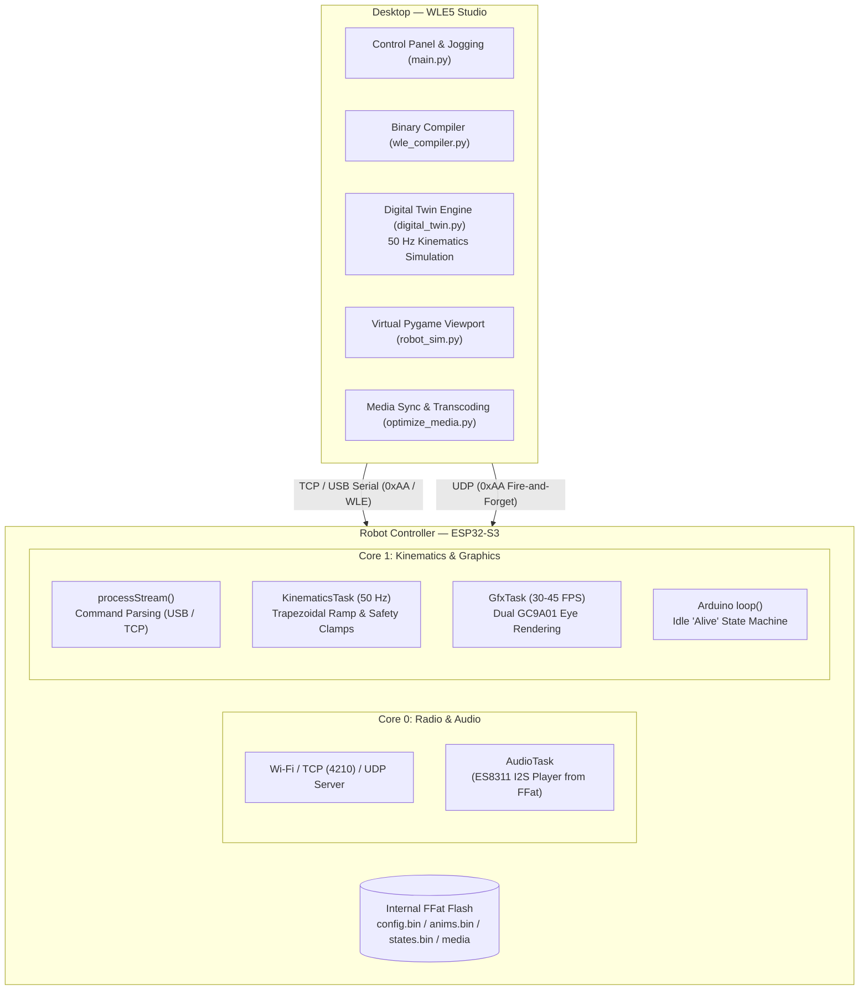
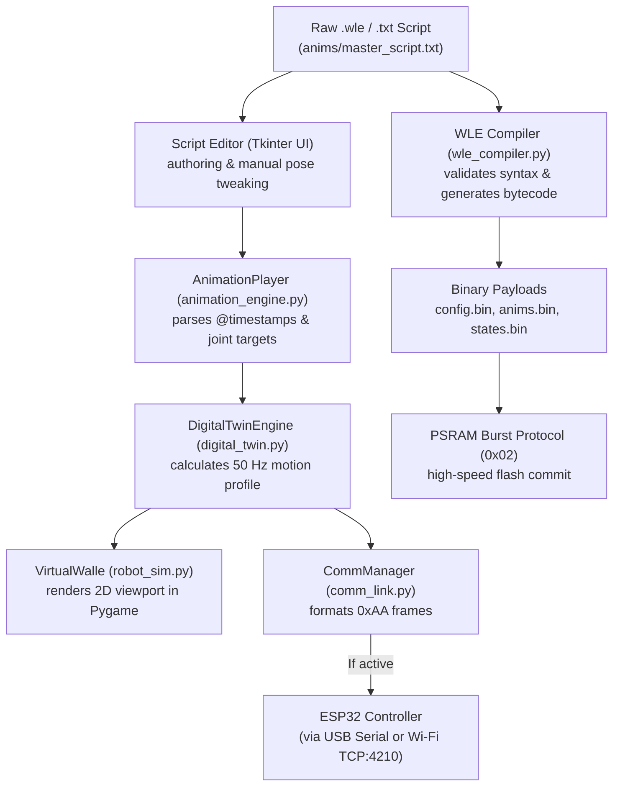

# WLE5 Technical Specification: System Architecture

**Document Version:** 1.0  
**Target Platform:** ESP32-S3 (Dual-Core Xtensa LX7 @ 240MHz, 8MB PSRAM, 16MB Flash)  
**Host Application:** WLE5 Animation Studio (Python 3.10+ / Tkinter / Pygame)

---

## 1. System Overview

WLE5 is a hybrid cyber-physical platform designed for animatronic robot control. It decouples high-level animation authoring, timeline choreography, and simulation on a host PC from real-time kinematics, I2S audio playback, dual-display procedural graphics rendering, and multi-transport communications on an embedded ESP32-S3 microcontroller.



---

## 2. Desktop Application Architecture ("WLE5 Studio")

The PC-side suite is a modular Python application (`python/main.py`) packaged via `WLE5_Studio.spec` containing nine core subsystems:

```
python/
├── main.py              # Central Tkinter GUI, event loop, and Pygame canvas orchestration
├── digital_twin.py      # Master kinematics engine running 50 Hz physics matching ESP32 firmware
├── robot_sim.py         # Pygame 2D digital twin visualizer rendering real-time animated servo positions
├── animation_engine.py  # Timeline player, keyframe scheduler, and .wle script parser
├── comm_link.py         # Multi-transport network manager (TCP client, Serial, UDP broadcaster)
├── wle_compiler.py      # Binary compiler generating config.bin, anims.bin, and states.bin
├── config_editor.py     # GUI editor for robot_master.json and hardware mapping
├── media_sync.py        # Asset transfer manager pushing image/audio buffers over WLE protocol
└── optimize_media.py    # FFmpeg/Pillow wrapper transcoding media to RGB565 and 16/24 kHz MP3
```

### 2.1 Python Subsystem Responsibilities

| Module | Core Class / Functions | Primary Responsibility |
|---|---|---|
| **`main.py`** | `WalleStudioApp` | Hosts the Tkinter UI layout, manages hotkeys, docks joint parameter tables, handles live arming (`>>SIM<<` vs `<LIVE>`), and embeds the Pygame viewport (`robot_sim.py`) for visual feedback. |
| **`digital_twin.py`** | `DigitalTwinEngine` | Pure Python forward kinematics engine running a deterministic 50 Hz physics loop. Calculates exact trapezoidal acceleration ramps ($d_{\text{brake}} = v^2 / (2 a_{\text{max}})$), software limits clamping, speed integration, and instant snap handling ($255$). |
| **`robot_sim.py`** | `VirtualWalle` | Embedded Pygame 2D canvas that renders real-time visual representations of the head yaw, head tilt, neck pitch, eyelid openings, and eye gaze vectors. |
| **`animation_engine.py`** | `AnimationPlayer`, `WLEParser` | Parses `.wle` keyframe syntax (`@time joint=val,spd`), interpolates commands across multi-joint timelines, and schedules keyframe dispatch to the digital twin and communications layer. |
| **`comm_link.py`** | `CommManager` | Multi-transport link manager supporting USB Serial (115200 baud) and Wi-Fi TCP/UDP (port 4210). Packs normalized `0xAA` motion packets, parses 17-byte telemetry heartbeat frames, and manages socket buffers and watchdog timeouts. |
| **`wle_compiler.py`** | `WLECompiler` | Bytecode compiler that validates joint ranges and packs authored scripts into memory-aligned binary files (`config.bin`, `anims.bin`, `states.bin`). Handles version and content hash calculations for delta syncing. |
| **`config_editor.py`** | `ConfigEditorDialog` | Tkinter configuration editor for `robot_master.json`. Allows modifying servo pulse limits (`cmd_min`, `cmd_max`), physical ranges (`r_min`, `r_max`), channel assignments, and exports `robot_config.h`. |
| **`media_sync.py`** | `MediaSyncManager` | Handles asset transfer over the `'W''L''E'` maintenance protocol (`0x02`), querying flash file manifests (`0xEE 0x01`), deleting files, and flushing RAM caches. |
| **`optimize_media.py`** | `MediaOptimizer` | Automated media transcode pipeline. Wraps `ffmpeg` to downsample audio to 16 kHz mono MP3 (24 kHz for tracks >12s) and wraps `Pillow` to convert graphics into 234×234 16-bit RGB565 raw bitmaps. |

### 2.2 Script & Command Flow Pipeline



---

## 3. Main Controller Firmware Architecture (ESP32-S3)

### 3.1 FreeRTOS Task Layout & Core Affinity
To eliminate servo jitter and prevent SPI display refreshes from stuttering audio or motion, tasks are partitioned strictly across the two CPU cores:

| Task Name | Core | Priority | Frequency | Stack Size | Primary Responsibility |
|---|:---:|:---:|:---:|:---:|---|
| **Wi-Fi / Network Stack** | Core 0 | System | Dynamic | Dynamic | TCP server (port `4210`), UDP listener, Wi-Fi reconnection logic. |
| **`AudioTask`** | Core 0 | Priority 2 | Event / Loop | 8 KB | Streams MP3/WAV audio from FFat to ES8311 I2S DAC; handles gain staging. Core 0 is reserved for radio/audio to isolate kinematics. |
| **`KinematicsTask`** | Core 1 | Priority 3 | Fixed 50 Hz | 4 KB | Solves trapezoidal acceleration/velocity curves; updates PCA9685 I2C & servo PWM. Highest real-time application priority. |
| **`GfxTask`** | Core 1 | Priority 1 | 30–45 FPS | 8 KB | Procedural eyelid/aperture math, sprite rendering, and dual SPI LCD DMA pushes. |
| **Arduino `loop()`** | Core 1 | Priority 1 | Free-running | Default | Stream parser (`processStream`), idle state engine, and animation timeline ticks. |

### 3.2 Kinematics & Motion Profile (`updateJointPhysics()`)
Physical servos are driven at a deterministic **50 Hz tick rate** (`updateJointPhysics()` in `Walle-double.ino`, mirrored in `digital_twin.py`).
- **Trapezoidal Acceleration Calculation**: Derives safe braking distance from current velocity $v$ and configured maximum acceleration/deceleration $a_{\text{max}}$:
  $$d_{\text{brake}} = \frac{v^2}{2 \cdot a_{\text{max}}}$$
- **Velocity Slew & Clamping**: Ramps `current_velocity` toward requested `target_velocity` (clamped to `max_spd`), and integrates position.
- **Instant Snap Override**: When commanded speed is `255`, the ramp is bypassed, immediately setting `current_position = target_position`.

### 3.3 Command Arbitration Hierarchy
Three command producers can set a joint's `target_position` / `target_velocity`, arbitrated inside `pushCommandToEngine()`:
1. **Live External Commands (Highest Priority)**: Arrives from TCP, USB, UDP, or RC link. Receiving a live command for a joint currently under animation cancels that animation (`active_anim_id = 0`) — live human operator authority always takes precedence.
2. **Animation Playback (Medium Priority)**: Keyframes (`BinKeyframe`/`BinCommand`) from a loaded `BinAnimation`, played against elapsed timeline clock.
3. **Idle-State ("Alive") Behavior Engine (Lowest Priority)**: After `idle_timeout_sec` of inactivity, executes weighted-random animation selection per the active idle state (e.g. `Alive`, `Shifty`, `Sleepy`), plus autonomous blink cycles and aperture focus hunting.

---

## 4. Compiled Binary Payload Format & Memory Layout

`wle_compiler.py` converts authored assets into three binary files that firmware loads directly into RAM:

| Binary File | Header Magic | Contents & Structure |
|---|:---:|---|
| **`config.bin`** | `"WLEC"` | `version` (u32) + `joint_count` (u8) + `BinJointConfig[]` hardware map |
| **`anims.bin`** | `"WLEA"` | `content_hash` (u32) + `anim_count` (u8) + `BinAnimation[]` (names, keyframe counts, and packed `BinCommand` records) |
| **`states.bin`** | `"WLES"` | `idle_timeout_sec` (u32) + `state_count` (u8) + `BinIdleState[]` (weighted lists of anims, weights, variances, and cooldowns) |

### 4.1 Packed C Binary Structures

```c
// config.bin Joint Record (32 bytes aligned)
struct __attribute__((packed)) BinJointConfig {
    uint8_t  joint_id;
    char     name[16];
    uint8_t  control_type;  // 0=Direct PCA9685, 1=ESP32 GPIO, 2=Virtual
    uint8_t  channel;       // 0-15 PCA9685 or GPIO pin
    uint16_t cmd_min;       // Servo pulse minimum (microseconds or tick count)
    uint16_t cmd_max;       // Servo pulse maximum
    float    r_min;         // Physical software range minimum
    float    r_max;         // Physical software range maximum
    float    r_init;        // Home / default rest position
    uint8_t  default_spd;   // Default slew velocity
    uint8_t  accel_limit;   // Maximum acceleration step
};

// anims.bin Keyframe Command Record
struct __attribute__((packed)) BinCommand {
    uint8_t joint_id;       // Target joint (physical or virtual)
    uint8_t target_value;   // Normalized setpoint (0-255)
    uint8_t speed;          // Commanded slew speed (255 = snap)
};
```

### 4.2 PSRAM Memory Staging & In-Place Commit
- **Staging Buffer**: Incoming binary blobs are streamed directly into an 8 MB external PSRAM buffer via the `'W''L''E' 0x02` protocol.
- **CRC32 Checksum Validation**: After the final byte is received, the ESP32 calculates the CRC32 of the PSRAM buffer and compares it with the header checksum.
- **Flash Flush & Live Table Reload**: The validated buffer is committed to internal FFat flash, and `processCompletedFile()` instantly rebuilds internal lookup tables (`ROBOT_CONFIG[]`, `activeAnimations[]`, `idle_actions[]`) without requiring a microcontroller reboot.
