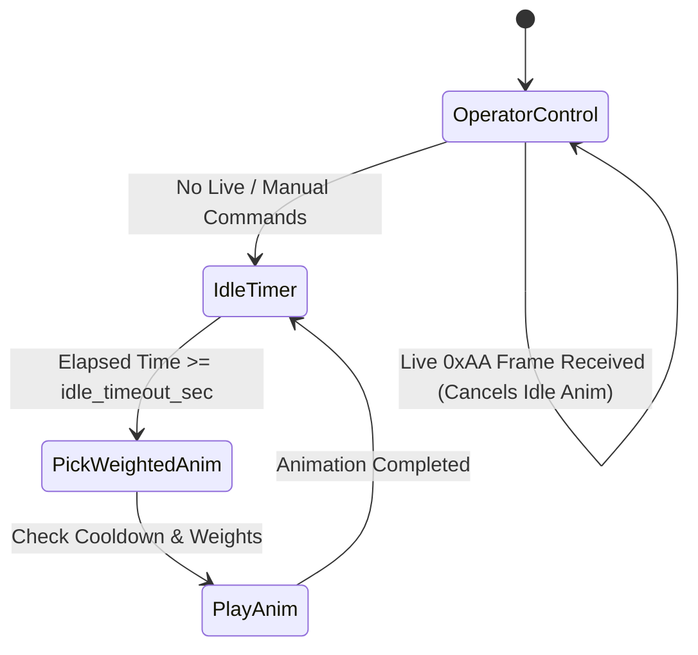

# WLE5 Technical Specification: Scripting & Joint Engine

**Document Version:** 1.0  
**Target Platform:** ESP32-S3 / WLE5 Animation Studio  
**Data Storage:** `/config/robot_master.json` $\to$ `config.bin`, `anims.bin`, `states.bin`

---

## 1. Scripting Syntax (`.wle` / `.txt`)

Animations and autonomous behaviors are authored in plain-text script files located in `/anims`. The syntax is designed for human readability, ease of authoring, and rapid compilation into compact binary structs.

### 1.1 Block Definitions & Syntax Rules
Scripts are structured into three distinct block types:

1. **Global Configuration Block (`[Config]`):**
   Defines global parameters such as default joint travel speed and autonomous idle timeouts:
   ```wle
   [Config]
   def_speed = 50
   idle_timeout = 5.0
   ```

2. **Idle State Definition Block (`[State: StateName]`):**
   Defines an autonomous emotional state containing random interval timing and a weighted list of animations:
   ```wle
   [State: Alive]
   interval_min = 2.0
   interval_max = 6.0
   Anim: Look_Around, 50, 1.0, 5.0
   Anim: Blink_Slow, 30, 0.5, 3.0
   Anim: Head_Tilt,  20, 1.2, 8.0
   ```
   *Format:* `Anim: <AnimationName>, <Weight (0-100)>, <Variance (0.0-2.0)>, <CooldownSec>`

3. **Animation Definition Block (`[Anim: AnimationName]`):**
   Defines a sequence of timed keyframes containing joint target values and optional speeds:
   ```wle
   [Anim: Wave_Hello]
   @0.0s   arm_l_lift=45,120   head_tilt=-10
   @0.5s   arm_l_wave=30,200   v_glow_pulse=100,255
   @0.8s   arm_l_wave=-30,200
   @1.1s   arm_l_wave=30,200
   @1.5s   arm_l_lift=0,60     head_tilt=0,50   v_glow_pulse=50,100
   ```

### 1.2 Keyframe Syntax Rules
- **Timestamp (`@<time>s`)**: Specifies the absolute execution time in seconds from animation start (e.g. `@0.0s`, `@1.25s`).
- **Joint Assignment (`<joint_name>=<target>[,<speed>]`)**:
  - `<target>`: Target value within the joint's configured real-world software range (`r_min` to `r_max`).
  - `<speed>` *(optional)*: Commanded travel velocity (`1` to `254` for smooth acceleration, or `255` for instant hardware snap). If omitted, defaults to the joint's `def_spd`.

---

## 2. Idle State ("Alive") Engine at Runtime

When no live operator commands or manual animations are active, the firmware's idle state engine takes control of the robot's physical demeanor:



1. **Inactivity Timer**: Resets on any incoming command. If no command is received for `idle_timeout_sec`, autonomous state logic activates.
2. **State Selection**: The active state is set via the virtual joint `v_idle_state` (or defaults to state ID `1` = `Alive`). Setting `v_idle_state=0` disables autonomous idle animations entirely.
3. **Weighted Selection with Cooldowns**: Evaluates all candidate animations in the active state:
   - Filters out animations currently under active cooldown timers.
   - Computes weighted-random selection among eligible candidates.
   - Scales animation playback speed by a random factor within the configured `Variance` window.

---

## 3. Joint Configuration Reference (`robot_master.json`)

All joints (physical servos, motor channels, and virtual registers) are configured in `/config/robot_master.json` and compiled into `config.bin` and `robot_config.h`.

### 3.1 Control Types (`Ctrl Type`)

| Type ID | Control Type | Hardware / Driver Target | Typical Application |
|:---:|---|---|---|
| **0** | `PCA9685_SERVO` | I2C PCA9685 PWM Driver (Ch 0–15) | Standard micro/standard servos (head pitch, neck, arms). |
| **1** | `ESP32_SERVO` | Direct ESP32 GPIO PWM | High-speed dedicated direct servos. |
| **2** | `VIRTUAL_JOINT` | Software Dispatch (ID $\ge$ 100) | Eye graphics, audio tracks, animation triggers, state toggles. |
| **3** | `DIGITAL_PIN` | Direct GPIO High/Low | Solenoid valves, relays, simple LEDs. |
| **4** | `DAC_AUDIO` | Internal I2S DAC / Codec | Audio output channel routing. |
| **5** | `LEDC_MOTOR` | ESP32 High-Frequency LEDC PWM | DC motors, H-bridges, or custom high-frequency actuators. |

### 3.2 Parameter Dictionary

#### Addressing
- **`id`**: Unique system integer (0–255). Physical joints: `0–99`; Virtual joints: `100–255`.
- **`name`**: Human-readable identifier used in animation scripts (e.g. `head_yaw`, `v_eyelid`).
- **`region`**: Logical anatomical grouping for UI organization (e.g. `1=Head`, `2=Neck`, `3=Arms`, `4=Virtual`).
- **`hardware_address`**: Physical output pin or PCA9685 channel index (0–15).

#### Software Range (`r_` parameters)
Engineering units exposed to animators and scriptwriters:
- **`r_min`**: Minimum limit in real-world units (e.g., `-90.0` degrees).
- **`r_max`**: Maximum limit in real-world units (e.g., `+90.0` degrees).
- **`r_init`**: Default rest position on boot.

#### Hardware Command Range (`cmd_` parameters)
Physical electrical signals sent to drivers, mapped automatically via linear interpolation:
- **`cmd_min`**: Pulse width in microseconds (or PWM duty cycle) corresponding to `r_min` (e.g. `500` µs).
- **`cmd_max`**: Pulse width in microseconds corresponding to `r_max` (e.g. `2500` µs).
- **`cmd_init`**: Immediate hardware hold position sent on boot before software initializes.

#### Kinematics & Physics Constraints
50 Hz trajectory profile parameters enforced by the firmware motion engine:
- **`def_spd`**: Baseline slew velocity applied if an animation script omits speed.
- **`max_spd`**: Hard velocity ceiling enforced by the physics engine.
- **`max_acc`**: Acceleration / deceleration smoothing factor:
  - `1 – 15`: Organic S-curve acceleration (smooth, gentle movement for heavy linkages).
  - `255`: Instantaneous snap (bypasses acceleration ramp).

---

## 4. Virtual Joints (`Ctrl Type = 2`, IDs $\ge$ 100)

Virtual joints do not produce physical PWM signals. When received in `pushCommandToEngine()`, they are routed to graphic renderers, audio playback engines, or state machines. They share the identical 3-byte command wire format (`joint_id`, `setpoint`, `speed`) as physical servos.

### 4.1 Virtual Joint Parameter Reference Guide (`0–100` Scale)
Virtual targets are specified on a normalized **`0–100`** scale in scripts and scaled to byte values (`0–255`) on the wire.

| Category | Virtual Joint Name | ID | Target Value Range & Meaning | Speed Behavior | Functional Description |
|---|---|:---:|---|---|---|
| **Visual Graphics** | `v_eyelid` | 100 | **0 to 101**<br>• `0` = Fully Open<br>• `100` = Fully Closed<br>• `101` = Auto-Blink Enabled | `0–255` | Coordinates bilateral eyelid closure and autonomous blinking. |
| **Visual Graphics** | `v_aperture` | 101 | **0 to 101**<br>• `0` = Contracted / Small<br>• `100` = Dilated / Wide<br>• `101` = Auto-Twitch Enabled | `0–255` | Controls pupil / camera iris aperture dilation. |
| **Visual Graphics** | `v_glow_color` | 102 | **0 to 101**<br>• `0` = Glow Off<br>• `1–100` = Iris Color Wheel Hue<br>• `101` = Dynamic Rainbow Cycling | `1–254` (fade)<br>`255` (snap) | Selects background iris glow hue and effects. |
| **Visual Graphics** | `v_glow_pulse` | 103 | **0 to 100**<br>• `0` = Static 80% Brightness<br>• `1–100` = Direct Brightness Level | `0–255` | Sets iris glow backlight intensity. |
| **Visual Graphics** | `v_img_select` | 104 | **0 to 255**<br>Selects cached RGB565 sprite index | `255` (instant) | Selects image asset to display or overlay. |
| **Visual Graphics** | `v_img_opacity` | 105 | **0 to 100**<br>• `0` = Invisible / Hidden<br>• `100` = Fully Opaque | `0–255` | Controls alpha blend / fade speed of selected image. |
| **Visual Graphics** | `v_gaze_x` | 106 | **0 to 100**<br>• `0` = Look Hard Left<br>• `50` = Center<br>• `100` = Look Hard Right | `0–255` | Controls horizontal eye pupil gaze offset. |
| **Visual Graphics** | `v_gaze_y` | 107 | **0 to 100**<br>• `0` = Look Hard Up<br>• `50` = Center<br>• `100` = Look Hard Down | `0–255` | Controls vertical eye pupil gaze offset. |
| **Asymmetry Link** | `v_asymmetry` | 108 | **0 or 1**<br>• `0` = Bilateral Linked Eyes<br>• `1` = Independent Asymmetric Mode | `255` (instant) | Enables separate rendering channels for left and right eyes. |
| **Asymmetric Eye** | `v_r_eyelid` | 109 | **0 to 100** (Right eye eyelid closure) | `0–255` | Independent right eye eyelid position (when asymmetric). |
| **Asymmetric Eye** | `v_r_gaze_x` | 110 | **0 to 100** (Right eye horizontal gaze) | `0–255` | Independent right eye horizontal gaze (when asymmetric). |
| **Asymmetric Eye** | `v_r_gaze_y` | 111 | **0 to 100** (Right eye vertical gaze) | `0–255` | Independent right eye vertical gaze (when asymmetric). |
| **System Command** | `v_audio_play` | 115 | **0 to 255**<br>Audio asset track index<br>• `255` = Stop Current Playback | Speed = Volume (`0–255`) | Triggers I2S MP3 playback from flash audio library. |
| **System Command** | `v_play_anim` | 116 | **0 to 255**<br>Numeric animation index to trigger | `255` (instant) | Triggers on-demand playback of a compiled animation. |
| **System Command** | `v_idle_state` | 117 | **0 to 255**<br>• `0` = Disable Idle Engine<br>• `254` = hide fps/loop<br>• `255` = display fps/loop | `255` (instant) | Selects active autonomous idle behavior state. |

---

### 4.2 Asymmetry Toggle & Independent Eye Control

By default, the graphics rendering engine (`z_eye_render.ino`) mirrors primary gaze variables (`v_gaze_x`, `v_gaze_y`, `v_eyelid`) synchronously across both round LCD displays.

```
                  ┌───────────────────────────────┐
                  │   v_asymmetry = 0 (Linked)    │
                  └───────────────┬───────────────┘
                                  │
                 ┌────────────────┴────────────────┐
                 ▼                                 ▼
          [ Left Eye LCD ]                 [ Right Eye LCD ]
      v_gaze_x / v_eyelid               v_gaze_x / v_eyelid
```
```
                  ┌───────────────────────────────┐
                  │ v_asymmetry = 1 (Independent) │
                  └───────────────┬───────────────┘
                                  │
                 ┌────────────────┴────────────────┐
                 ▼                                 ▼
          [ Left Eye LCD ]                 [ Right Eye LCD ]
      v_gaze_x / v_eyelid             v_r_gaze_x / v_r_eyelid
```

When `v_asymmetry=100,255` is commanded:
1. Firmware sets internal flag `isAsymmetric = true`.
2. The right display detaches from shared channels and routes calculations to `v_r_gaze_x`, `v_r_gaze_y`, and `v_r_eyelid`.
3. The left display continues following standard `v_gaze_x`, `v_gaze_y`, and `v_eyelid` channels.

#### Asymmetric Wink & Chameleon Gaze Script Example:
```wle
[Anim: Asymmetric_Wink_And_Gaze]
# 1. Enable independent eye rendering immediately
@0.0s   v_asymmetry=100,255

# 2. Look in opposite directions (Chameleon Gaze: Left looks left, Right looks right)
@0.1s   v_gaze_x=0,100    v_r_gaze_x=100,100

# 3. Wink right eye (Snap right eyelid shut, keep left eye open)
@1.5s   v_eyelid=0,255    v_r_eyelid=100,255

# 4. Open right eye, snap both gazes back to center, and relink screens
@3.0s   v_r_eyelid=0,100  v_gaze_x=50,255  v_r_gaze_x=50,255
@3.5s   v_asymmetry=0,255
```

---

## 5. Packed Binary Struct Specifications

The compiler generates packed C binary files with zero padding for direct memory-mapped access on the ESP32:

```c
// 1-byte struct alignment
#pragma pack(push, 1)

struct BinJointConfig {
    uint8_t id;
    char    name[32];
    uint8_t region;
    uint8_t control_type;
    int8_t  hardware_address;
    float   r_min;
    float   r_max;
    float   r_init;
    int16_t cmd_min;
    int16_t cmd_max;
    int16_t cmd_init;
    uint8_t def_spd;
    uint8_t max_spd;
    uint8_t max_acc;
};

struct BinCommand {
    uint8_t joint_id;
    uint8_t target_val;
    uint8_t speed_val;
};

struct BinKeyframe {
    uint32_t   time_ms;
    uint8_t    cmd_count;
    BinCommand cmds[]; // dynamically sized array
};

#pragma pack(pop)
```
