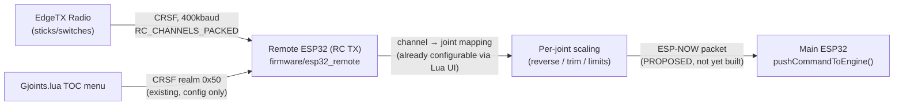

# RC Manual Control over ESP-NOW — Current State & Proposed Design

**Status: in development.** This is the one subsystem in the project that is not yet
functional end-to-end. This doc splits cleanly into two parts: what's actually implemented
today (§1–2), and a proposed design for the missing piece (§3–6), written to slot into the
existing conventions documented elsewhere rather than invent a parallel set of patterns.

## 1. Goal

A second ESP32 ("RC TX"), physically installed in the external module bay of an EdgeTX
radio, should read live channel values from the radio over the Crossfire (CRSF) link, map
those channels to robot joints, and stream the result to the main ESP32 in real time over
**ESP-NOW** — a low-latency, connectionless, peer-to-peer Wi-Fi protocol that needs no
access point or IP handshake. This is deliberately a **different transport and packet
format** from the existing TCP/USB/UDP live-command channel used by WLE5 Studio (see
[02-communication-protocols.md](04-communication-protocols.md) §1), because the radio-side
ESP32 has no reason to join the robot's Wi-Fi network just to move a joint.



## 2. What already exists

- **Wired CRSF link**: `firmware/esp32_remote/CrsfESP32.ino` already opens
  `HardwareSerial(2)` at 400,000 baud (pins 25/26) to the radio's module bay and correctly
  frames/parses CRSF bytes (`pollCrsfRx`, CRC-8 poly `0xD5`).
- **Joint → channel mapping is already a first-class, configurable field.** The `Joint`
  struct on the remote ESP32 has a `channel` member, and the EdgeTX Lua script
  (`Gjoints.lua`) already has a UI to assign/clear which CRSF channel drives which joint
  (`get/set` around line ~318, rendered as `CH<n>` or `none`), persisted back to the
  remote ESP32 via the existing `SUB_WRITE_JOINT` (`0x12`) command. Each `Joint` also
  already carries `reverse`, `mode`, `min_us`/`max_us`, `min_limit`/`max_limit`, and
  `trim` — everything needed to scale a raw channel value into a joint setpoint.
- **What's missing on the remote ESP32 side**: `handleFrame()` only recognizes CRSF frame
  type `0x32` (COMMAND, used by the TOC/config protocol). It does not yet parse the
  standard CRSF `RC_CHANNELS_PACKED` frame (type `0x16`) that carries the radio's actual
  live stick/switch values — so today, the channel assignment is stored but nothing reads
  or acts on it in real time.
- **What's missing entirely**: any ESP-NOW code on either ESP32, and any packet format
  for it.

## 3. Proposed remote-ESP32 additions

1. **Decode `RC_CHANNELS_PACKED` (type `0x16`)** alongside the existing COMMAND-frame
   handling in `handleFrame()` — this is a standard CRSF frame (11 bits × 16 channels,
   packed into 22 bytes) distinct from the private `REALM_TOC` extension already
   implemented, so it can be added without touching the existing config protocol.
2. **Per-tick channel → joint scaling**, using fields the `Joint` struct already has:
   for each joint with a non-null `channel`, take that channel's decoded value, apply
   `reverse`, clamp to `min_limit`/`max_limit`, add `trim`, and normalize to a single byte
   `0–255` — the same normalized-setpoint convention already used by the `0xAA` frame
   (`comm_link.py`'s `send_packets` does the equivalent clamp/normalize on the PC side).
   Reusing that convention means the main ESP32 needs **no new scaling logic** — only a
   new ingress path.
3. **Rate-limit to roughly the kinematics tick rate (50 Hz)** rather than forwarding every
   CRSF frame (CRSF channel updates can arrive well above that) — there's no benefit to
   the main ESP32 receiving joint updates faster than `KinematicsTask` consumes them.

## 4. Proposed ESP-NOW packet

Deliberately mirrors the existing `0xAA` live-command frame's `(joint_id, setpoint,
speed)` triplet, so it's a **new transport carrying an already-defined command shape**,
not a new command language:

```c
struct __attribute__((packed)) EspNowManualCtrlPacket {
    uint8_t magic;      // 0xE5 — distinguishes this app's ESP-NOW traffic from anything else
    uint8_t seq;        // rolling counter; lets the receiver detect drops/reordering
    uint8_t count;      // number of joint updates in this packet (<= 16, same cap as 0xAA)
    struct {
        uint8_t joint_id;
        uint8_t setpoint;   // 0-255, identical convention to the 0xAA frame
        uint8_t speed;      // 0-255; 255 = snap instantly
    } cmds[count];
    uint8_t failsafe;   // 1 = radio link-loss/failsafe asserted at the transmitter
};
```

On the main ESP32, an `esp_now_recv_cb` would simply iterate `cmds[]` and call
`pushCommandToEngine(joint_id, setpoint, speed)` for each — exactly the function the TCP,
USB, and UDP paths already call, so command arbitration (an RC command cancels a running
animation on that joint, just like a live TCP command does) falls out for free.

## 5. Wi-Fi channel coexistence — resolved via arm/disarm

The initial concern was that ESP-NOW requires both peers on the same 2.4 GHz channel, and
the main ESP32's station-mode connection to the household AP pins it to whatever channel
that AP happens to use — with no simple way for the remote ESP32 to know that channel in
advance.

**Resolution: disconnect from the AP (not the radio) while RC control is armed, and
reconnect on disarm.** ESP-NOW itself still needs the Wi-Fi stack active — this isn't
"turn Wi-Fi off," it's "drop the AP association while keeping the radio in STA mode."
Concretely:

- **Arm** (triggered by a dedicated radio switch, see below): main ESP32 calls
  `WiFi.disconnect()` (AP session torn down, TCP server no longer reachable), then
  `esp_wifi_set_channel()` to a **fixed, hardcoded channel** shared by both firmwares
  (e.g. channel 1), registers the remote ESP32 as an ESP-NOW peer, and starts accepting
  `EspNowManualCtrlPacket`s.
- **Disarm**: tear down the ESP-NOW peer, then `WiFi.begin(ssid, pass)` to rejoin the AP
  as before; TCP/UDP resume once reconnected.

This removes the channel-discovery problem entirely — because the AP is no longer in the
picture while armed, there's no external channel constraint to track, so both sides can
just agree on a fixed channel number rather than needing any broadcast/discovery scheme.

Follow-on effects worth being explicit about, so they're a deliberate tradeoff rather than
a surprise:

- **WLE5 Studio's TCP session drops for the duration RC is armed.** This is arguably the
  *intent* — Studio and RC manual control shouldn't be fighting over the same joints —
  but worth confirming. **USB Serial is unaffected**, since it's a separate transport
  from Wi-Fi; if Studio access during armed RC is wanted, USB stays live throughout.
- **Reconnect delay on disarm.** Rejoining the AP and getting a DHCP lease takes a few
  seconds, so there's a brief dead zone before Studio can reconnect after disarming.
  Worth surfacing in whatever status/telemetry display is used, the same way boot-time
  Wi-Fi status is already shown on the eye displays.
- **Arm/disarm should be its own explicit signal, not inferred from packet presence.**
  Treat it as a dedicated CRSF switch position, mapped the same way joint channels are
  already mapped in `Gjoints.lua`/the remote ESP32's `Joint` struct, rather than treating
  "packets are arriving" as "should be armed." That keeps arming distinct from the
  link-loss failsafe below — if the radio briefly goes out of range while armed, the
  right response is to freeze/release the joints (§6), not to silently toggle Wi-Fi
  back on and off mid-flight.

## 6. Other open design decisions worth confirming before implementation

- **Peer pairing.** ESP-NOW needs each side's MAC address registered as a peer. A one-time
  pairing step (e.g. triggered from the Lua menu, broadcasting until the main ESP32
  answers) versus a hardcoded MAC address is a tradeoff between convenience and
  robustness across hardware swaps.
- **Failsafe / link-loss behavior.** If ESP-NOW packets stop arriving (radio out of range,
  RC TX powered off), the main ESP32 should not freeze joints at their last commanded
  position indefinitely. A short watchdog (e.g. a few hundred ms — much shorter than the
  existing 30 s TCP telemetry watchdog, since this is real-time control) that falls back
  to releasing RC-driven joints back to idle/animation control would match the "live
  input always wins, but only while it's actually live" spirit already used for TCP/UDP
  commands.
- **Priority vs. WLE5 Studio.** If both a TCP live-jog session and RC manual control are
  active simultaneously, decide which wins per-joint (likely: whichever last sent a
  command for that joint, same as how TCP and UDP already interleave today).
- **Bidirectional use of the same radio link.** Since the wired CRSF connection is shared
  with the existing TOC config protocol (realm `0x50`), confirm that RC_CHANNELS_PACKED
  frames and the private COMMAND frames don't need to be prioritized against each other
  on that UART — currently they're just two different frame types multiplexed over the
  same physical link, which should be fine as long as `pollCrsfRx()`'s framing stays
  frame-type-agnostic (it already is).

