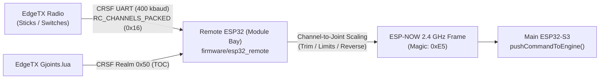
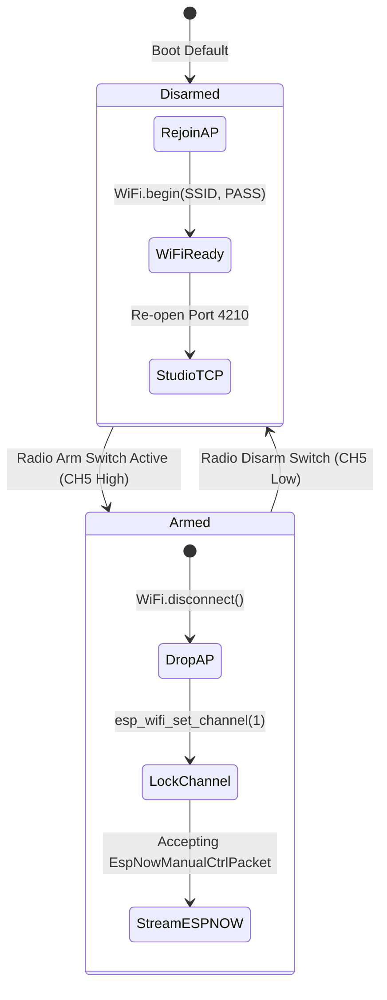

# WLE5 Technical Specification: RC Manual Control & ESP-NOW Link

**Document Version:** 1.0 (Design & Architecture)  
**Status:** In Development  
**Target Hardware:** EdgeTX Radio (TX16S / Boxer / Pocket) + Remote ESP32 (Module Bay) ↔ Main Robot ESP32-S3

---

## 1. System Architecture

The RC manual control subsystem enables real-time stick and switch driving from an EdgeTX radio transmitter to the main robot controller over low-latency peer-to-peer **ESP-NOW**.



---

## 2. Implemented Subsystems vs. Roadmap

| Subsystem Component | Implementation Status | Implementation File |
|---|:---:|---|
| **EdgeTX Lua Configuration UI** | ✅ Completed | `firmware/esp32_remote/Gjoints.lua` |
| **Wired CRSF UART Receiver (400k)** | ✅ Completed | `firmware/esp32_remote/CrsfESP32.ino` |
| **CRSF Table-of-Contents (TOC) Realm** | ✅ Completed | `CrsfESP32.ino` (`REALM_TOC` 0x50) |
| **CRSF `RC_CHANNELS_PACKED` (0x16) Decoder** | 🔄 In Development | `firmware/esp32_remote/CrsfESP32.ino` |
| **ESP-NOW Peer-to-Peer Transmitter** | 🔄 In Development | `firmware/esp32_remote/CrsfESP32.ino` |
| **ESP-NOW Ingress & Failsafe Receiver** | 🔄 In Development | `firmware/esp32_main/z_sys_mgr.ino` |

---

## 3. Wire Protocols & Packet Structures

### 3.1 CRSF 11-Bit Channel Unpacking (`0x16`)
The radio streams 16 analog channels packed into 22 bytes every 2–5 ms. The remote ESP32 unrolls these 11-bit integers:

```c
void decodeCrsfChannels(const uint8_t* payload, uint16_t* channels) {
    channels[0]  = ((payload[0]       | payload[1]  << 8)) & 0x07FF;
    channels[1]  = ((payload[1]  >> 3  | payload[2]  << 5)) & 0x07FF;
    channels[2]  = ((payload[2]  >> 6  | payload[3]  << 2 | payload[4] << 10)) & 0x07FF;
    channels[3]  = ((payload[4]  >> 1  | payload[5]  << 7)) & 0x07FF;
    channels[4]  = ((payload[5]  >> 4  | payload[6]  << 4)) & 0x07FF;
    channels[5]  = ((payload[6]  >> 7  | payload[7]  << 1 | payload[8] << 9)) & 0x07FF;
    // ... mapped from raw CRSF (172..1811) to standard microseconds (1000..2000 us)
}
```

### 3.2 Proposed ESP-NOW Control Frame (`0xE5`)
The remote ESP32 converts assigned channels to normalized joint setpoints and sends them over ESP-NOW at a rate-limited **50 Hz**:

```c
struct __attribute__((packed)) EspNowManualCtrlPacket {
    uint8_t magic;      // 0xE5 — Application Identifier
    uint8_t seq;        // Rolling sequence counter (0–255)
    uint8_t count;      // Number of joint updates (1–16)
    struct {
        uint8_t joint_id; // Physical (0–99) or Virtual (100–118)
        uint8_t setpoint; // 0–255 normalized position
        uint8_t speed;    // 0–255 slew rate (255 = instant)
    } cmds[16];
    uint8_t failsafe;   // 1 = Radio link lost / transmitter disarmed
};
```

---

## 4. Wi-Fi Channel Coexistence & Arming State Machine

ESP-NOW requires both sender and receiver to operate on the identical 2.4 GHz RF channel.



### 4.1 Failsafe & Watchdog Guarantees
- **250ms Heartbeat Watchdog**: If no valid ESP-NOW packet arrives within 250ms while armed, the main ESP32 automatically decelerates joints to their neutral `home_pos` and clears live overrides.
- **Animation Safety**: Live RC stick inputs cancel any running animation on the commanded joints, ensuring manual operator authority at all times.
